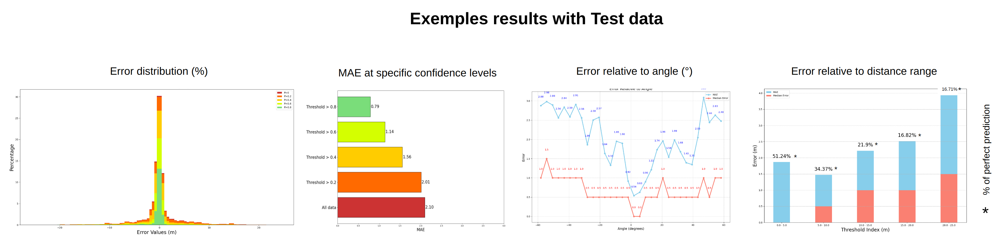

# ROSS: A Deep Convolutional Network for Radar Open Space Segmentation


ROSS is a deep convolutional neural network designed to process range angle radar data for open space segmentation in autonomous driving. It efficiently detects the boundary of drivable space .


# Table of Contents

1. [Installation](#Installation) 
2. [Dataset](#Dataset)
3. [Data Preparation](#Data-Preparation)
4. [Usage](#Usage)
    - [Training](#Training)
    - [Visualize data](#Visualize-data)
    - [Test](#Test)
    - [Inference](#Inference)
5. [Main results](#Main-results)

# Installation
### Clone this repository
```bash
git clone https://github.com/AntoineHUET1/Radar_Open_Space_Segmentation.git
```
To install the package, run the following command::
```bash
pip install -r requirements.txt
```
# Dataset

Leddar PixSet Dataset is a publicly available dataset containing approximately 29k frames from 97 sequences recorded in high-density urban areas, using a set of various sensors (cameras, LiDARs, radar, IMU, etc.).

 

### Download Dataset

**Direct Download** from this Google Drive link: [Dataset](https://drive.google.com/file/d/13Pai83qq33uq0tttysR4l-IUvQKHGcix/view?usp=sharing)

### [Optional] Manually generate the dataset  (Not available yet)

1. Download the [Leddar PixSet Dataset](https://dataset.leddartech.com/) from the official website.
2. Extract the dataset in the root directory of the project in data folder.
    ```bash
   cd $PROJECTROOT
    mkdir -p data
    ln -s $PIXETDATASET data/Pixet_Dataset
    ```
3. Run the following script to generate ground truth data:
    ```bash
    # Not available yet
    GenerateGroundTruthData.py
    ```

# Data Preparation:

Once the dataset is downloaded and extracted, create a symbolic link to the data directory.
```bash
cd $PROJECTROOT
mkdir -p data
ln -s $DATASET data/ROSS_Dataset
```

# Usage:

### Training

To train the model, run the following command:
```bash
python main.py --mode train
```
This will run the default training parameters stored in [ROSS_Config.py](ROSS%2Fcfg%2FROSS_Config.py)

To resume a interrupted training session, run the following command:
```bash
python main.py --mode train --config_path $CONFIG_PATH
```
with `$CONFIG_PATH` being the path to the configuration file stored in the experiment [results](Results) folder.


#### Command lines arguments for training pipeline

- `--config_path` (optional, string): Path to the configuration file. If provided, this will override the default configuration used in the project.

- `--radar_range` (optional, integer): Defines the range of the radar detection in meters.

- `--ROSS_FOV` (optional, integer): Sets the Field of View (FOV) for the ROSS system in degrees.

- `--GT_mode` (optional, integer): Defines the mode for ground truth (GT) data handling:
  - `0`: Use all available data for training and evaluation.
  - `1`: Use only data where obstacles are within the radar's range.

- `--num_epochs` (optional, integer): Sets the number of epochs to run during training.

- `--patience` (optional, integer): Specifies the number of epochs to wait before stopping training if no improvement is observed. 

### Visualize data

To visualize data, run the following command:
```bash
python main.py --mode visualize
```

#### Command lines arguments for visualization pipeline

- `--sequence` (optional, string): Name of the sequence to visualize. If not provided, a random sequence from the dataset will be used.
- `--radar` (optional, boolean, default: True): Determines whether to visualize radar data. 
- `--camera` (optional, boolean, default: True): Determines whether to visualize front camera data.
- `--GT` (optional, boolean, default: True): Determines whether to visualize ground truth data.
- `--frame_number` (optional, integer): Specifies the frame number to visualize. If not provided, the entire sequence will be visualized.
- `--FPS` (optional, integer): Sets the frames per second for the visualization.

 
### Test
To test data and generate graphs, run the following command:
```bash
python main.py --mode test
```
#### Command lines arguments for test pipeline
- `--config_path` (required, string): Path to the configuration file stored in the experiment results folder.
- `--model_path` (required, string): Path to the model file.
- `--label` (optional, string): Path to the output label.
- `--show_graph` (optional, boolean): If set, displays the sequence graph.

 

### Inference

To inference data, run the following command:
```bash
python main.py --mode inference
```

#### Command lines arguments for inference pipeline

- `--config_path` (required, string): Path to the configuration file stored in the experiment [results](Results) folder you want to use for inference.
- `--label` (optional, string): Path to the output label.
- `--sequence` (optional, string): Name of the sequence for inference.

# Main results

Training results for different radar ranges are available in the following Google Drive links:

### Mode 1: Use only data where obstacles are within the radar's range

| Distance | Mean absolute error | Median | IOU  | Checkpoint + config                                                                                       |
|----------|---------------------|--------|------|-----------------------------------------------------------------------------------------------------------|
| 5 m      | 0.18 m              | 0.12 m | 0.96 | [Training results](https://drive.google.com/drive/folders/1nwu6_Hrn7KZ6yFw2tr-eVn-TNIWbRF36?usp=sharing<br/>)   |
| 10 m     | 0.47 m              | 0.2 m  | 0.94 | [Training results](https://drive.google.com/drive/folders/1eVCl2aL4WhAg_9TeMUoMZ-L4BnGLfqzK?usp=sharing)  |
| 15 m     | 0.91 m              | 0.3 m  | 0.92 | [Training results](https://drive.google.com/drive/folders/16LXsuevQZPzDpMvgfPcKYKkAyug-3pAa?usp=sharing)  |
| 20 m     | 1.4 m               | 0.5 m  | 0.9  | [Training results](https://drive.google.com/drive/folders/16UyVYpTmMjaRXp9KqkQdMitjbpMKGpf-?usp=drive_link)   |
| 25 m     | 1.98 m              | 0.6 m  | 0.88 | [Training results](https://drive.google.com/drive/folders/1kWb_vohHXr6PBAwPJdt7q8VrvwLmvBOt?usp=sharing) |
| 30 m     | 2.31 m              | 0.7 m  | 0.87 | [Training results](https://drive.google.com/drive/folders/12Kg-Uxs8XMcxY2i5pGyjr0Np-8SVbSHM?usp=sharing) |
| 35 m     | 2.65 m              | 0.7 m  | 0.87 | [Training results](https://drive.google.com/drive/folders/1rHa7H7UPl8-2lSbPTVE20-GCtoohlo_3?usp=sharing)  |
| 40 m     | 2.99 m              | 0.9 m  | 0.86 | [Training results](https://drive.google.com/drive/folders/1a3rJls64zkXf4vwY_LBfGSvI_oC0hRiM?usp=sharing)  |
| 45 m     | 3.39 m              | 0.9 m  | 0.85 | [Training results](https://drive.google.com/drive/folders/1HkwF0j6ADsfSRm3hPOU-RFF2F9jalyAE?usp=sharing) |
| 50 m     | 3.39 m              | 1 m    | 0.85 | [Training results](https://drive.google.com/drive/folders/18JTeYsUmsAua8wI2PXbqy6b6qKUfmUth?usp=sharing) |

### Mode 2: Use all available data for training and evaluation

| Distance | Mean absolute error | Median | IOU  | Checkpoint + config                                                                                       |
|----------|---------------------|--------|------|-----------------------------------------------------------------------------------------------------------|
| 25 m     | 2.68 m              | 0.7 m  | 0.86 | [Training results](https://drive.google.com/drive/folders/1pBArJ4rSw9TBk_WtobqxFw1o_WcN9MMQ?usp=sharing) |
| 30 m     | 3.09 m              | 0.7 m  | 0.86 | [Training results](https://drive.google.com/drive/folders/1NvuTgzZAJ3rNj0-rtSnSlBqfrQSF0Gkc?usp=sharing) |
| 35 m     | 3.51 m              | 0.9 m  | 0.85 | [Training results](https://drive.google.com/drive/folders/1DVL3oQQ9PxeYvxuYZWlX4tgtV_aACC8S?usp=sharing)  |
| 40 m     | 4.12 m              | 1.2 m  | 0.84 | [Training results](https://drive.google.com/drive/folders/1WwQQW12zoo4Tx-ILkY4fkYJnuspICwPr?usp=drive_link)  |
| 45 m     | 4.59 m              | 1.4 m  | 0.83 | [Training results](https://drive.google.com/drive/folders/1y0X1dhLaYmuJlC6JgOTc82C73ljNeAFB?usp=drive_link) |
| 50 m     | 5.24 m              | 1.6 m  | 0.82 | [Training results](https://drive.google.com/drive/folders/1SEV6Vfy6dBTyyXipqkPx9kgjpHEC3CLp?usp=drive_link) |
