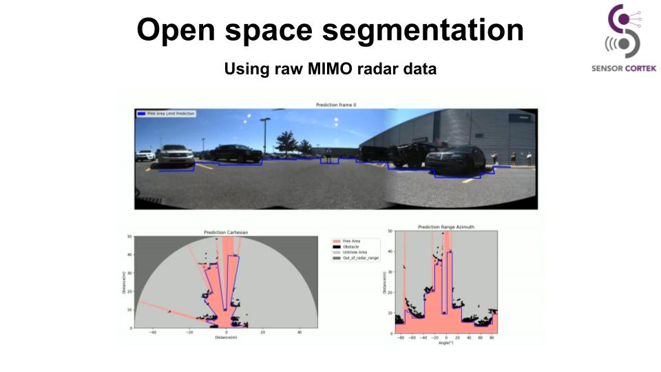

# ROSS: A Deep Convolutional Network for Radar Open Space Segmentation
*Antoine Huet*

## Abstract
ROSS is a deep convolutional neural network designed to process raw radar data for open space segmentation in autonomous driving. It efficiently detects the boundary of drivable space using a simplified model based on the LeNet architecture.

