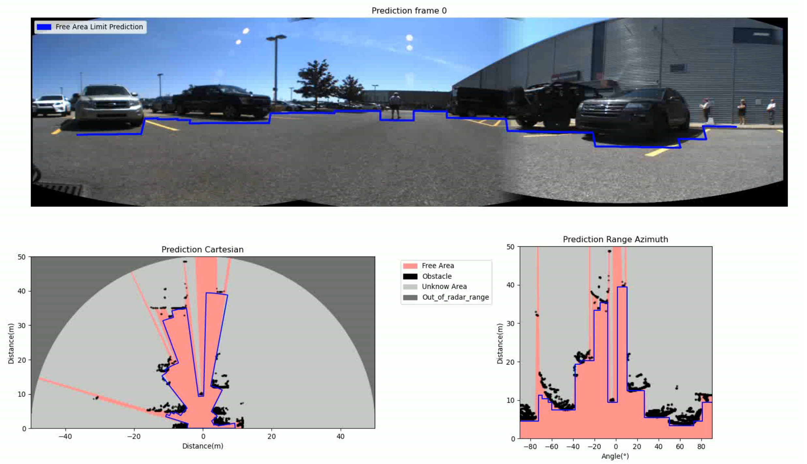
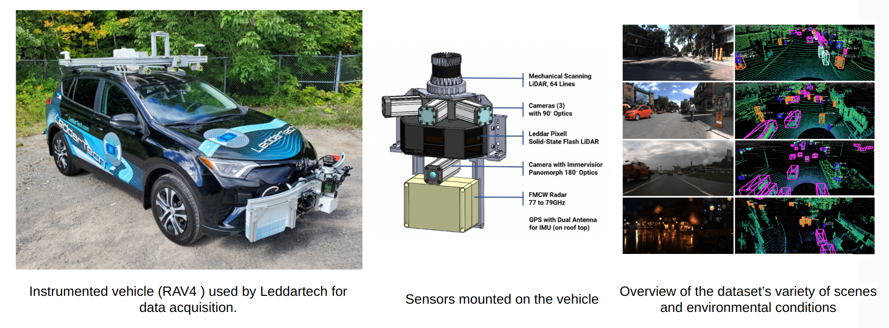
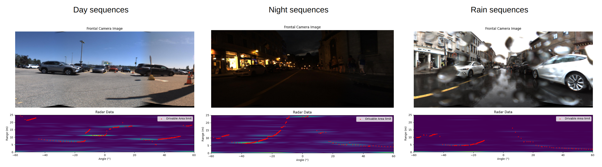
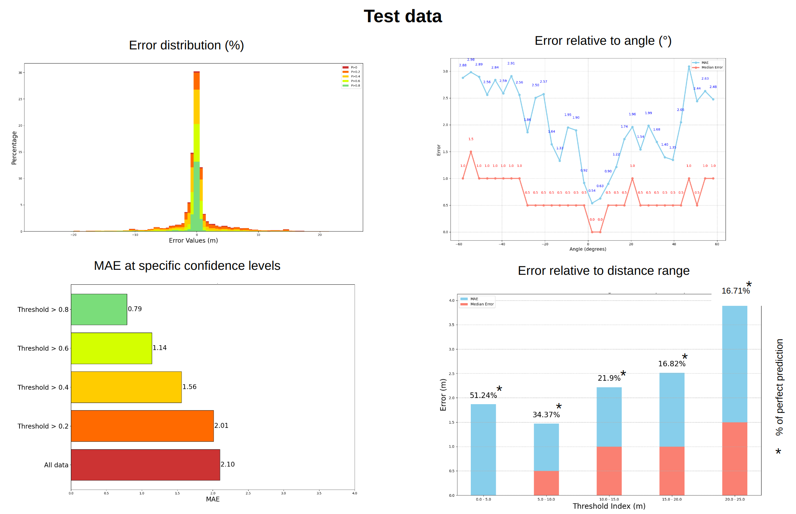

# ROSS: A Deep Convolutional Network for Radar Open Space Segmentation


ROSS is a deep convolutional neural network designed to process raw radar data for open space segmentation in autonomous driving. It efficiently detects the boundary of drivable space using a simplified model based on the LeNet architecture.



# Table of Contents

1. [Installation](#Installation) 
2. [Dataset](#Dataset)
3. [Data Preparation](#Data-Preparation)
4. [Usage](#Usage)
    - [Training](#Training)
    - [Visualize data](#Visualize-data)
    - [Test](#Test)
    - [Inference](#Inference)
5. [Main results](#Main-results)

# Installation
### Clone this repository
```bash
git clone https://github.com/AntoineHUET1/Radar_Open_Space_Segmentation.git
```
To install the package, run the following command::
```bash
pip install -r requirements.txt
```
# Dataset

Leddar PixSet Dataset is a publicly available dataset containing approximately 29k frames from 97 sequences recorded in high-density urban areas, using a set of various sensors (cameras, LiDARs, radar, IMU, etc.).

 

### Download Dataset

**Direct Download** from this Google Drive link: [Dataset](https://drive.google.com/file/d/13Pai83qq33uq0tttysR4l-IUvQKHGcix/view?usp=sharing)

### [Optional] Manually generate the dataset  (Not available yet)

1. Download the [Leddar PixSet Dataset](https://dataset.leddartech.com/) from the official website.
2. Extract the dataset in the root directory of the project in data folder.
    ```bash
   cd $PROJECTROOT
    mkdir -p data
    ln -s $PIXETDATASET data/Pixet_Dataset
    ```
3. Run the following script to generate ground truth data:
    ```bash
    # Not available yet
    GenerateGroundTruthData.py
    ```

# Data Preparation:

Once the dataset is downloaded and extracted, create a symbolic link to the data directory.
```bash
cd $PROJECTROOT
mkdir -p data
ln -s $DATASET data/ROSS_Dataset
```

# Usage:

### Training

To train the model, run the following command:
```bash
python main.py --mode train
```
This will run the default training parameters stored in [ROSS_Config.py](ROSS%2Fcfg%2FROSS_Config.py)

To resume a interrupted training session, run the following command:
```bash
python main.py --mode train --config_path $CONFIG_PATH
```
with `$CONFIG_PATH` being the path to the configuration file stored in the experiment [results](Results) folder.


#### Command lines arguments for training pipeline

- `--config_path` (optional, string): Path to the configuration file. If provided, this will override the default configuration used in the project.

- `--radar_range` (optional, integer): Defines the range of the radar detection in meters.

- `--ROSS_FOV` (optional, integer): Sets the Field of View (FOV) for the ROSS system in degrees.

- `--GT_mode` (optional, integer): Defines the mode for ground truth (GT) data handling:
  - `0`: Use all available data for training and evaluation.
  - `1`: Use only data where obstacles are within the radar's range.

- `--num_epochs` (optional, integer): Sets the number of epochs to run during training.

- `--patience` (optional, integer): Specifies the number of epochs to wait before stopping training if no improvement is observed. 

### Visualize data

To visualize data, run the following command:
```bash
python main.py --mode visualize
```

#### Command lines arguments for visualization pipeline

- `--sequence` (optional, string): Name of the sequence to visualize. If not provided, a random sequence from the dataset will be used.
- `--radar` (optional, boolean, default: True): Determines whether to visualize radar data. 
- `--camera` (optional, boolean, default: True): Determines whether to visualize front camera data.
- `--GT` (optional, boolean, default: True): Determines whether to visualize ground truth data.
- `--frame_number` (optional, integer): Specifies the frame number to visualize. If not provided, the entire sequence will be visualized.
- `--FPS` (optional, integer): Sets the frames per second for the visualization.

 
### Test
To test data and generate graphs, run the following command:
```bash
python main.py --mode visualize
```
#### Command lines arguments for test pipeline
- `--config_path` (required, string): Path to the configuration file stored in the experiment results folder.
- `--model_path` (required, string): Path to the model file.
- `--label` (optional, string): Path to the output label.
- `--show_graph` (optional, boolean): If set, displays the sequence graph.

 

### Inference

To inference data, run the following command:
```bash
python main.py --mode inference
```

#### Command lines arguments for inference pipeline

- `--config_path` (required, string): Path to the configuration file stored in the experiment [results](Results) folder you want to use for inference.
- `--label` (optional, string): Path to the output label.
- `--sequence` (optional, string): Name of the sequence for inference.

# Main results
Coming soon...